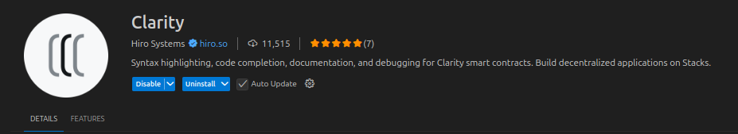

## Tooling
Tooling enforces discipline. It helps you write clean, consistent, and secure Clarity code — and catch issues before they become bugs. This section introduces the linters, formatters, and static analysis tools available in the Stacks ecosystem.

### Linters and Formatters
Linters and formatters enforce code style and surface syntactic issues early. While Clarity doesn’t yet have a dedicated linter like ESLint for JavaScript, Clarinet provides built-in formatting and syntax validation.

#### 1. Clarinet Format
Clarinet includes a built-in formatter that enforces consistent indentation, spacing, and structure for `.clar` files.

**Usage:**
```bash
  clarinet format
```

This command:

- Normalises indentation and spacing
- Aligns parentheses and expressions
- Ensures consistent formatting across contracts

**Best practice:** Run `clarinet format` before every commit to maintain a clean codebase.

Reference: [Clarinet CLI Reference - Format your code](https://docs.stacks.co/reference/clarinet/cli-reference#format-your-code)

#### 2. Syntax Validation
Clarinet automatically checks for:

- Invalid Clarity syntax
- Type mismatches
- Unbound variables
- Invalid function calls

These checks run during `clarinet check` and `clarinet test`, and help catch issues before deployment.

### Static Analysis Tools
Static analysis inspects your code without executing it. It helps detect vulnerabilities, logic errors, and violations of best practices.

#### 1. Clarinet Check
```bash
  clarinet check
```

This command performs:

- Type checking
- Function signature validation
- Contract interface resolution
- Cross-contract dependency analysis

It ensures that your contract compiles and links correctly before deployment.

#### 2. Clarity Language Server (CLS)
The Clarity Language Server provides IDE support for:

- Syntax highlighting
- Autocompletion
- Inline type hints
- Real-time error detection

It integrates with editors like VS Code via the Clarity extension.

**Installation:**
Search for “Clarity” in the VS Code Marketplace.
