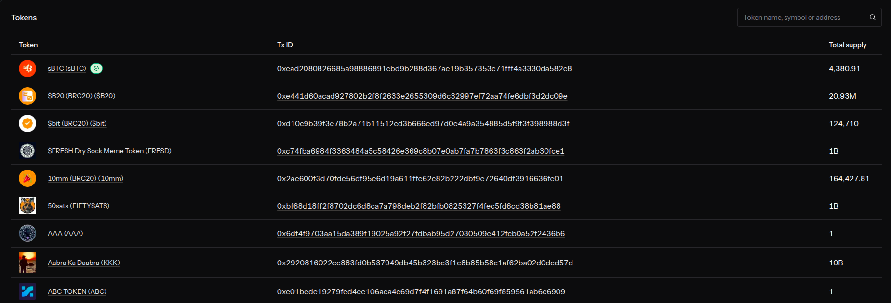

## Fungible Tokens (SIP-010)
Fungible tokens are the backbone of decentralised finance. They represent interchangeable units of value, like currencies, points, or shares — and are governed by strict interface standards to ensure compatibility across wallets, contracts, and dApps. This section introduces the SIP-010 standard, its required and optional functions, and how to implement and test a compliant token in Clarity.

### What Are Fungible Tokens?
Fungible tokens are digital assets where each unit is identical and interchangeable. One token is always equal to another of the same type. Common use cases include:
- **Currencies** (e.g. STX, USDC)
- **Governance tokens** (e.g. DAO voting power)
- **Reward points** (e.g. staking rewards)
- **Shares or units** in a protocol

In Clarity, fungible tokens are implemented as smart contracts that expose a standardised interface for transferring, querying, and managing balances.


### SIP-010 Interface
SIP-010 defines the **standard trait** for fungible tokens on Stacks. Any contract that implements this trait can be recognised and interacted with by wallets, explorers, and other contracts.

**Required functions:**
- `(transfer (amount uint) (sender principal) (recipient principal)) : (response bool uint)`
- `(get-balance (owner principal)) : (response uint uint)`
- `(get-total-supply) : (response uint uint)`

These functions ensure basic token functionality: moving tokens, checking balances, and querying total supply.

**Optional metadata functions:**
- `(get-name) : (response (string-ascii 32) uint)`
- `(get-symbol) : (response (string-ascii 10) uint)`
- `(get-decimals) : (response uint uint)`

These provide human-readable context for wallets and explorers.

```Clojure
  (define-trait sip010-ft-standard
    (
      ;; Required functions
      (transfer (amount uint) (sender principal) (recipient principal) (response bool uint))
      (get-balance (owner principal) (response uint uint))
      (get-total-supply () (response uint uint))

      ;; Optional metadata
      (get-name () (response (string-ascii 32) uint))
      (get-symbol () (response (string-ascii 10) uint))
      (get-decimals () (response uint uint))
    )
  )

  (define-map balances ((owner principal)) ((amount uint)))
  (define-data-var total-supply uint u1000000)

  ;; Metadata constants
  (define-constant token-name "MyToken")
  (define-constant token-symbol "MTK")
  (define-constant token-decimals u6)

  (define-public (transfer (amount uint) (sender principal) (recipient principal))
    (begin
      (asserts! (is-eq tx-sender sender) (err u100)) ;; Unauthorized
      (let ((sender-balance (default-to u0 (map-get? balances sender))))
        (asserts! (>= sender-balance amount) (err u101)) ;; Insufficient balance
        (map-set balances sender (- sender-balance amount))
        (let ((recipient-balance (default-to u0 (map-get? balances recipient))))
          (map-set balances recipient (+ recipient-balance amount)))
        (ok true))))

  (define-read-only (get-balance (owner principal))
    (ok (default-to u0 (map-get? balances owner))))

  (define-read-only (get-total-supply)
    (ok (var-get total-supply)))

  (define-read-only (get-name)
    (ok token-name))

  (define-read-only (get-symbol)
    (ok token-symbol))

  (define-read-only (get-decimals)
    (ok token-decimals))
```

Reference: [SIP-010 Fungible Token Standard](https://github.com/stacksgov/sips/blob/main/sips/sip-010/sip-010-fungible-token-standard.md)

### Implementing a SIP-010 Token in Clarity
To implement a SIP-010 token, you must:
1. Define the trait using `use-trait` or `define-trait`
2. Implement all required functions
3. Optionally expose metadata functions
4. Maintain internal state: balances, total supply, and access control

**Example:**
```Clojure
  (define-map balances ((owner principal)) ((amount uint)))
  (define-data-var total-supply uint u1000000)

  (define-public (transfer (amount uint) (sender principal) (recipient principal))
    (begin
      (asserts! (is-eq tx-sender sender) (err u100))
      (let ((sender-balance (default-to u0 (map-get? balances sender))))
        (asserts! (>= sender-balance amount) (err u101))
        (map-set balances sender (- sender-balance amount))
        (let ((recipient-balance (default-to u0 (map-get? balances recipient))))
          (map-set balances recipient (+ recipient-balance amount)))
        (ok true))))
```

This example enforces sender authorisation, checks balances, and updates state.

### Testing Token Transfers and Balances
Use Clarinet’s testing framework to simulate transfers and validate balances.

**Test case:**
```ts
  it("transfers tokens between accounts", async () => {
    const chain = simnet.chain("devnet");
    const deployer = chain.accounts.get("deployer");
    const user = chain.accounts.get("wallet_1");

    const block = chain.mineBlock([
      Tx.contractCall("token", "transfer", [types.uint(100), deployer.address, user.address], deployer.address),
    ]);

    expect(block.receipts[0].result).toEqual(types.ok(types.bool(true)));
  });
```

**Suggested test coverage:**
- Valid transfers
- Insufficient balance
- Unauthorised sender
- Balance queries before/after transfer
- Total supply consistency

Reference: [Clarinet Unit Testing Guide](https://docs.stacks.co/build/clarinet-js-sdk/unit-testing)